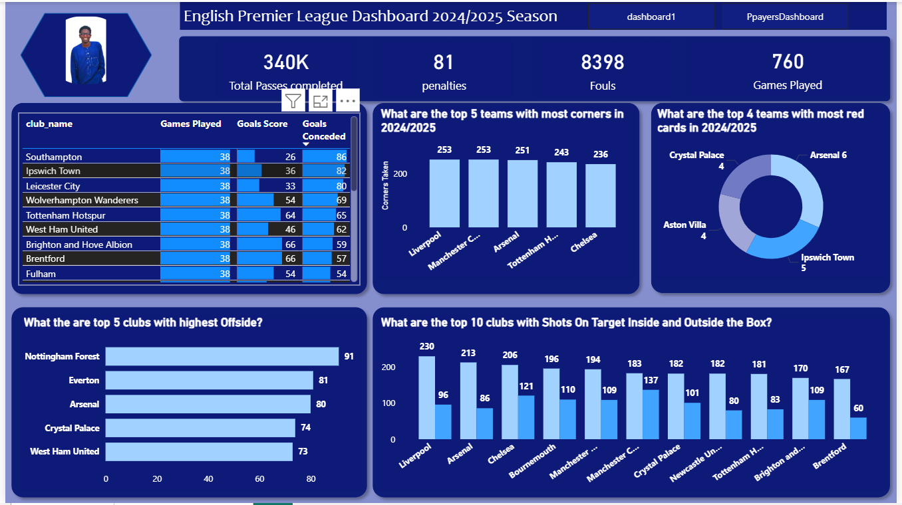
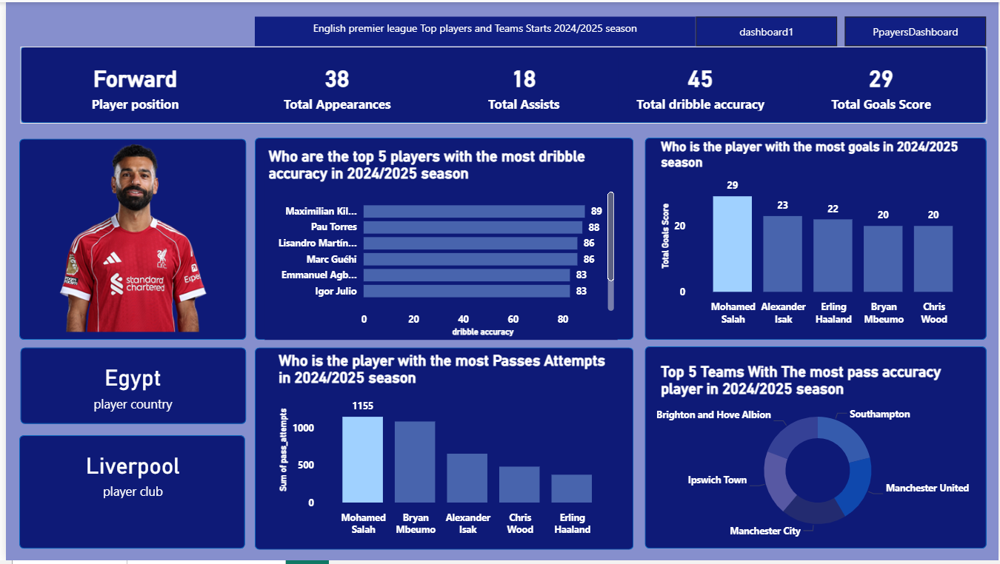
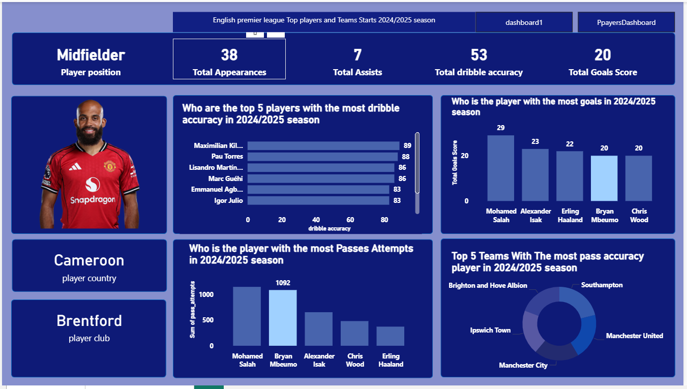
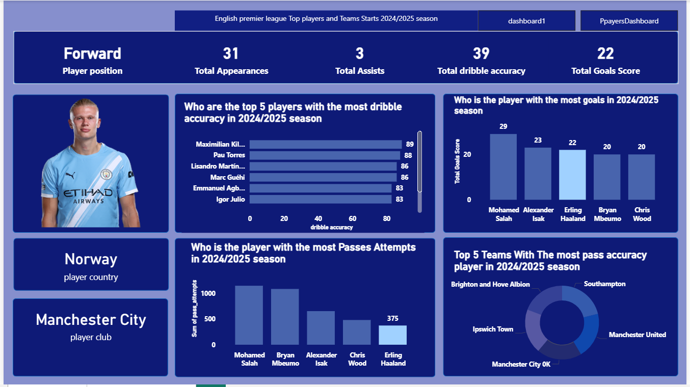
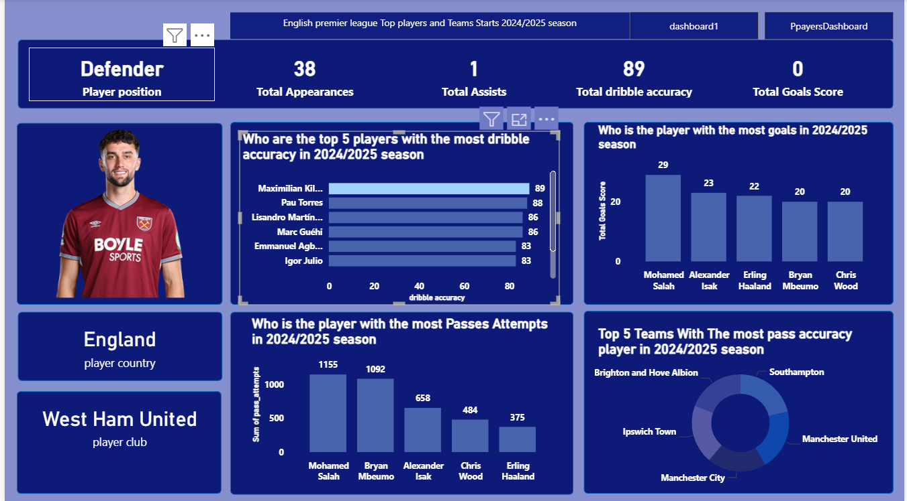
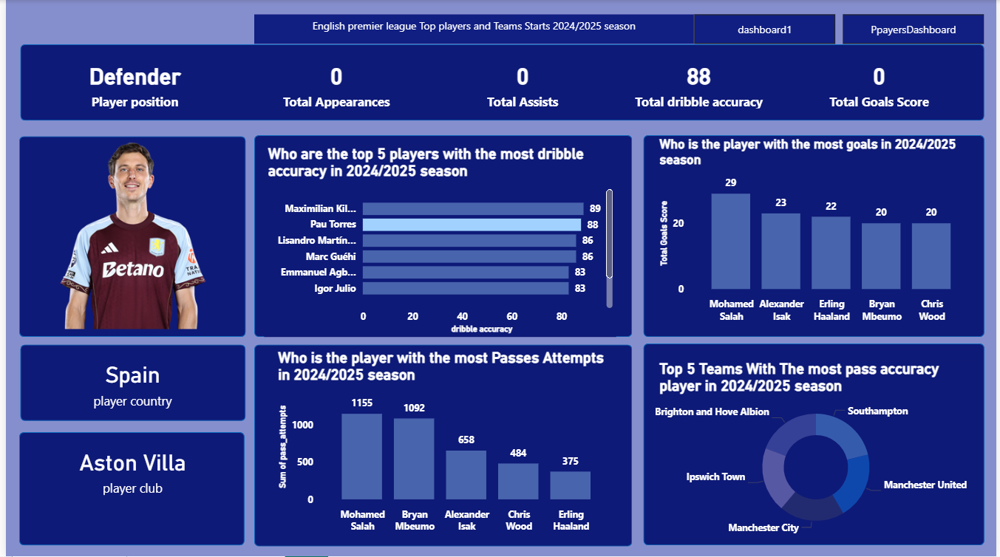
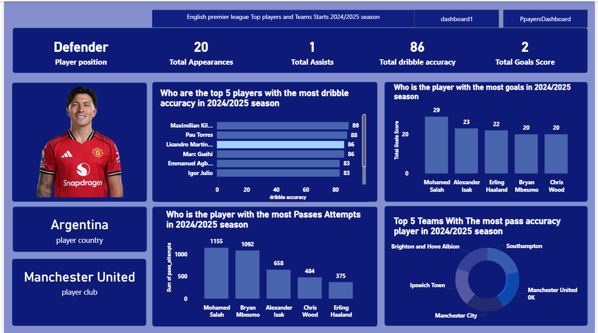
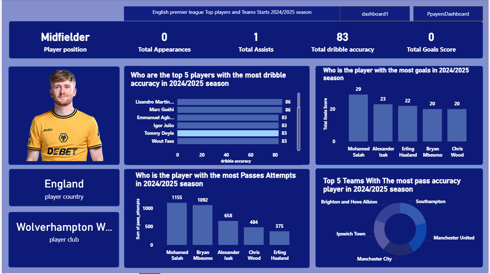
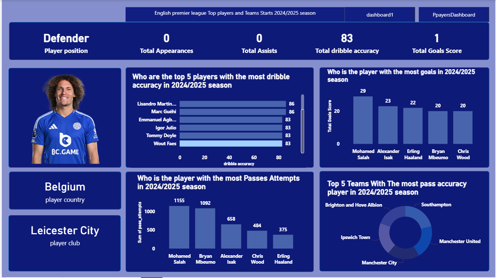

# Premier-League-Performance-Dashboard
## 📌 Project Overview
This project is an **interactive Premier League dashboard** designed to analyze team and match performance across a season.  
The dashboard transforms raw football data into **clear, visual insights** that help understand team dominance, scoring trends, and overall league performance.

This project focuses on **data cleaning, analysis, and storytelling through visualization**.

---

## 📂 Dataset Description
The dataset contains Premier League match and team-level data, including:
- Teams
- Matches played
- Wins, draws, and losses
- Goals scored and conceded
- Points
- Season information

The data was cleaned and structured to ensure accurate analysis and meaningful visualizations.

---

## 🎯 Business / Analysis Questions
The dashboard answers key questions such as:
- Which teams performed best during the season?
- Top 5 teams with the most corner
- Top 4 teams with most red card
- Top 5 teams with highest offside
- Top 10 teams with most short on target inside and outside the box
- Which player scored the most goals?
- Top 5 players with th most successful dribble?
- Top 5 players with highest passes accuracy?

---

## 📊 Dashboard Features
- table for clubs with goal score and goal conceeded
- Top 5 teams with most corners bar chart
- Top 4 teams with highest red card chart
- Top 5 teams with most offside chart
- Top 5 teams with highest ontarget inside and outside the box
- Performance ranking using key KPIs

---

## 🖼 Dashboard Preview

### 🔹 Overview

### 🔹 Goals Analysis

### 🔹 Goals Analysis

### 🔹 Goals Analysis

### 🔹 Dribble Analysis

### 🔹 Dribble Analysis

### 🔹 Dribble Analysis

### 🔹 Dribble Analysis

### 🔹 Dribble Analysis

---

## 🛠 Tools & Technologies Used
- Power BI / Excel 
- GitHub (project documentation and version control)

---

## 🧠 Key Learnings
- Cleaning and preparing real-world sports data
- Designing dashboards focused on clarity and insight
- Using KPIs to compare team performance
- Applying data storytelling principles
- Presenting analytics projects professionally on GitHub

---

## 🚀 How to Use This Project
1. Download the dashboard file from the `dashboard/` folder
2. Open it using Power BI / Excel 
3. Use the filters and visuals to explore team and league performance

---

## 📬 Feedback & Contributions
Feedback is welcome.  
If you have suggestions or improvements, feel free to open an issue or reach out.

---

**Author:** Usama  
**Field:** Data Analysis | Sports Analytics
